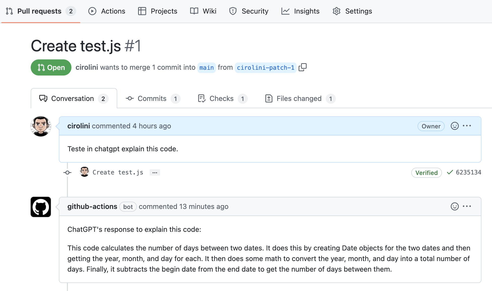

# Code Review with ChatGPT

This project aims to automate code review using the ChatGPT language model. It integrates  with Github Actions, and upon receiving a Pull Request, it automatically sends each code review to ChatGPT for an explanation.

# Setup

The following steps will guide you in setting up the code review automation with ChatGPT.

## Prerequisites
Before you begin, you need to have the following:

- An OpenAI API Key. You will need a personal API key from OpenAI which you can get here: https://openai.com/api/. To get an OpenAI API key, you can sign up for an account on the OpenAI website https://openai.com/signup/. Once you have signed up, you can create a new API key from your account settings.
- A Github account and a Github repository where you want to use the code review automation.

### Step 1: Create a Secret for your OpenAI API Key

Create a secret for your OpenAI API Key in your Github repository or organization with the name `openai_api_key`. This secret will be used to authenticate with the OpenAI API.

You can do this by going to your repository/organization's settings, navigate to secrets and create a new secret with the name `openai_api_key` and paste your OpenAI API key as the value.

### Step 2: Adjust Permissions

Then you need to set up your project's permissions so that the Github Actions can write comments on Pull Requests. You can read more about this here: [automatic-token-authentication](https://docs.github.com/en/actions/security-guides/automatic-token-authentication#modifying-the-permissions-for-the-github_token)

### Step 3: Create a new Github Actions workflow in your repository in `.github/workflows/chatgpt-review.yaml. A sample workflow is given below:

```
on:
  pull_request:
    types: [opened, synchronize]

jobs:
  hello_world_job:
    runs-on: ubuntu-latest
    name: ChatGPT explain code
    steps:
      - name: ChatGTP explain code
        uses: cirolini/chatgpt-github-actions@v1.2
        with:
          openai_api_key: ${{ secrets.openai_api_key }}
          github_token: ${{ secrets.GITHUB_TOKEN }}
          github_pr_id: ${{ github.event.number }}
          openai_engine: "text-davinci-002" #optional
          openai_temperature: 0.5 #optional
          openai_max_tokens: 2048 #optional
```

In the above workflow, the pull_request event triggers the workflow whenever a pull request is opened or synchronized. The workflow runs on the ubuntu-latest runner and uses the cirolini/chatgpt-github-actions@v1 action.

The openai_api_key is passed from the secrets context, and the github_token is also passed from the secrets context. The github_pr_id is passed from the github.event.number context. The other three input parameters, openai_engine, openai_temperature, and openai_max_tokens, are optional and have default values.

## How it works

This action is triggered when a pull request is opened or updated. The action authenticates with the OpenAI API using the provided API key, and with the Github API using the provided token. It then selects the repository using the provided repository name, and the pull request ID. 
For each commit in the pull request, it gets the modified files, gets the file name and content, sends the code to ChatGPT for an explanation, and adds a comment to the pull request with ChatGPT's response.

Comments will appear like this:



## Security and Privacity

When sending code to the ChatGPT language model, it is important to consider the security and privacy of the code because user data may be collected and used to train and improve the model, so it's important to have proper caution and privacy policies in place.. OpenAI takes security seriously and implements measures to protect customer data, such as encryption of data in transit and at rest, and implementing regular security audits and penetration testing. However, it is still recommended to use appropriate precautions when sending sensitive or confidential code, such as removing any sensitive information or obscuring it before sending it to the model. Additionally, it is a good practice to use a unique API key for each project and to keep the API key secret, for example by storing it in a Github secret. This way, if the API key is ever compromised, it can be easily revoked, limiting the potential impact on the user's projects.

# Built With
- [OpenAI](https://openai.com/) - The AI platform used
- [Github Actions](https://github.com/features/actions) - Automation platform

## Authors
- **CiroLini** - [cirolini](https://github.com/cirolini)
