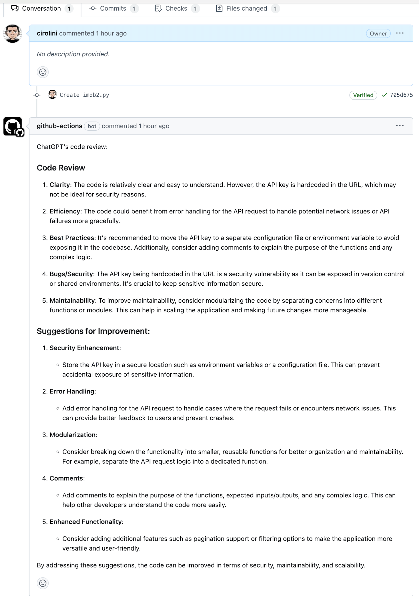

# GenAI Code Review

This project aims to automate code review using the GPT language model. It integrates with Github Actions and, upon receiving a Pull Request, automatically submits each code change to GPT for review.

# Setup

The following steps will guide you in setting up the code review automation with GPT.

## Prerequisites
Before you begin, you need to have the following:

- An OpenAI API Key. You will need a personal API key from OpenAI which you can get here: https://openai.com/api/. To get an OpenAI API key, you can sign up for an account on the OpenAI website https://openai.com/signup/. Once you have signed up, you can create a new API key from your account settings.
- A Github account and a Github repository where you want to use the code review automation.

### Step 1: Create a Secret for your OpenAI API Key

Create a secret for your OpenAI API Key in your Github repository or organization with the name `OPENAI_API_KEY`. This secret will be used to authenticate with the OpenAI API.

You can do this by going to your repository/organization's settings, navigate to secrets and create a new secret with the name `OPENAI_API_KEY` and paste your OpenAI API key as the value.

### Step 2: Adjust Permissions

Then you need to set up your project's permissions so that the Github Actions can write comments on Pull Requests. You can read more about this here: [automatic-token-authentication](https://docs.github.com/en/actions/security-guides/automatic-token-authentication#modifying-the-permissions-for-the-github_token)

### Step 3: Create the workflow

Add a new Github Actions workflow at `.github/workflows/genai-code-review.yml`. A sample workflow is given below:

```yaml
on:
  pull_request:
    types: [opened, synchronize]

permissions:
  contents: read
  pull-requests: write

jobs:
  code_review_job:
    runs-on: ubuntu-latest
    name: GenAI Code Review
    steps:
      # No actions/checkout step is needed. This action reads the pull request
      # over the GitHub API and never uses the repository on disk.
      - name: GenAI Code Review
        uses: cirolini/genai-code-review@v2
        with:
          openai_api_key: ${{ secrets.OPENAI_API_KEY }}
          github_token: ${{ secrets.GITHUB_TOKEN }}
          github_pr_id: ${{ github.event.number }}
          openai_model: "gpt-5.6-luna" # optional
          openai_temperature: 0.5 # optional
          openai_max_tokens: 2048 # optional
          mode: files # files or patch
          language: en # optional, default is 'en'
          custom_prompt: "" # optional
```

The `permissions` block is required. Without `pull-requests: write` the action
authenticates correctly but cannot post its comment.

In the above workflow, the `pull_request` event triggers the workflow whenever a pull request is opened or synchronized. The workflow runs on the `ubuntu-latest` runner.

`openai_api_key` and `github_token` are passed from the secrets context, and `github_pr_id` from the `github.event.number` context. The remaining inputs — `openai_model`, `openai_temperature` and `openai_max_tokens` — are optional and have defaults.

## Providers

v3 can send the review to OpenAI, Anthropic, Google Gemini, or any server that
speaks the OpenAI chat completions API. Pick one with `provider`:

```yaml
- uses: cirolini/genai-code-review@v3
  with:
    provider: anthropic
    api_key: ${{ secrets.ANTHROPIC_API_KEY }}
    github_token: ${{ secrets.GITHUB_TOKEN }}
    github_pr_id: ${{ github.event.number }}
```

| `provider` | Default model | Key from |
|---|---|---|
| `openai` (default) | `gpt-5.6-luna` | `api_key`, else `OPENAI_API_KEY` |
| `anthropic` | `claude-sonnet-5` | `api_key`, else `ANTHROPIC_API_KEY` |
| `gemini` | `gemini-3.8-flash` | `api_key`, else `GEMINI_API_KEY` |
| `openai-compatible` | none — `model` is required | `api_key`, optional |

Defaults are cost-conscious rather than each vendor's strongest model, because
this runs on every push to every pull request and the bill is yours. Set `model`
to choose a different one.

### Self-hosted and third-party endpoints

`openai-compatible` covers Ollama, vLLM, Azure OpenAI, OpenRouter, Together and
anything else exposing the same API. It needs `base_url`, and `api_key` is
optional so a local server with no auth works:

```yaml
    provider: openai-compatible
    base_url: http://localhost:11434/v1
    model: llama3
```

### Failures are never silent

If the provider rejects the key, does not know the model, or stays unavailable
through the retries, the action posts a comment saying so and fails the check.
A review that did not happen must not look like a review that found nothing.

## Configuration Parameters

### `provider`
- **Description**: Which LLM provider to use.
- **Default**: `openai`
- **Options**: `openai`, `anthropic`, `gemini`, `openai-compatible`.

### `model`
- **Description**: Model ID. See the table above for per-provider defaults.
- **Default**: the default for the chosen provider.

### `api_key`
- **Description**: API key for the chosen provider.
- **Default**: falls back to `openai_api_key`, then to the provider's own
  environment variable.

### `base_url`
- **Description**: Address of an OpenAI-compatible server. Required when
  `provider` is `openai-compatible`.
- **Default**: `""`

### `temperature` / `max_tokens`
- **Description**: Sampling temperature and response length cap.
- **Default**: `0.5` and `2048`. Fall back to `openai_temperature` and
  `openai_max_tokens`.

### Deprecated inputs
`openai_api_key`, `openai_model`, `openai_temperature` and `openai_max_tokens`
still work and are used whenever their v3 equivalent is unset, so a v2 workflow
runs on v3 unchanged. Earlier releases also documented an `openai_engine` input
that the action never read.

### `openai_temperature`
- **Description**: Controls the creativity of the AI's responses. Higher values make the output more random, while lower values make it more focused and deterministic.
- **Default**: `0.5`
- **Range**: `0.0` to `1.0`

### `openai_max_tokens`
- **Description**: The maximum number of tokens to generate in the completion.
- **Default**: `2048`
- **Range**: Up to the model's maximum context length.

### `mode`
- **Description**: Determines the method of analysis for the pull request.
- **Options**:
  - `files`: Analyzes the files changed in the last commit.
  - `patch`: Analyzes the patch content.

### `language`
- **Description**: The language in which the review comments will be written.
- **Default**: `en` (English)
- **Options**: Any valid language code, e.g., `pt-br` for Brazilian Portuguese.

### `custom_prompt`
- **Description**: Custom instructions for the AI to follow when generating the review.
- **Default**: `""` (empty)
- **Usage**: Provide specific guidelines or focus areas for the AI's code review.


## How it works

### files
This action is triggered when a pull request is opened or updated. The action authenticates with the OpenAI API using the provided API key, and with the Github API using the provided token. It then selects the repository using the provided repository name, and the pull request ID. 
For each commit in the pull request, it gets the modified files, gets the file name and content, sends the code to ChatGPT for an explanation, and adds a comment to the pull request with ChatGPT's response.

### patch
Every PR has a file called patch which is where the difference between 2 files, the original and the one that was changed, is, this strategy consists of reading this file and asking the AI to summarize the changes made to it.

Comments will appear like this:



## Custom Prompt

### Overview

The `custom_prompt` parameter allows users to tailor the AI's review to specific needs. By providing custom instructions, users can focus the review on particular aspects or request additional information. This flexibility enhances the usefulness of the AI-generated review comments.

### How to Use

To use a custom prompt, simply provide a string with your instructions. For example, to ask the AI to rate the code on a scale of 1 to 10, set the `custom_prompt` parameter as follows:

```yaml
custom_prompt: "Give a rating from 1 to 10 for this code:"
````

### Potential
Using a custom prompt can direct the AI to focus on specific areas, such as:

* Code quality and readability
* Security vulnerabilities
* Performance optimizations
* Adherence to coding standards
* Specific concerns or questions about the code

## Implementation in Code
The custom_prompt is integrated into the review generation as shown:

```
if custom_prompt:
      logging.info(f"Using custom prompt: {custom_prompt}")
      return f"{custom_prompt}\n### Code\n```{content}```\n\nWrite this code review in the following {language}:\n\n"
  return (f"Please review the following code for clarity, efficiency, and adherence to best practices. "
          f"Identify any ar...
```

This feature allows you to harness the power of AI in a way that best suits your specific code review requirements.

## Security and Privacity

When sending code to the ChatGPT language model, it is important to consider the security and privacy of the code because user data may be collected and used to train and improve the model, so it's important to have proper caution and privacy policies in place.. OpenAI takes security seriously and implements measures to protect customer data, such as encryption of data in transit and at rest, and implementing regular security audits and penetration testing. However, it is still recommended to use appropriate precautions when sending sensitive or confidential code, such as removing any sensitive information or obscuring it before sending it to the model. Additionally, it is a good practice to use a unique API key for each project and to keep the API key secret, for example by storing it in a Github secret. This way, if the API key is ever compromised, it can be easily revoked, limiting the potential impact on the user's projects.

# Built With
- [OpenAI](https://openai.com/) - The AI platform used
- [Github Actions](https://github.com/features/actions) - Automation platform

## Authors
- **CiroLini** - [cirolini](https://github.com/cirolini)

## Contributors
- **Glauber Borges** - [glauberborges](https://github.com/glauberborges)

# License
This project is licensed under the MIT License - see the LICENSE file for details.
